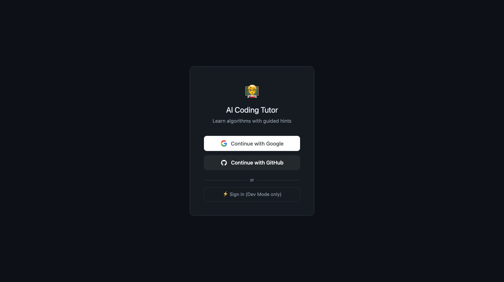
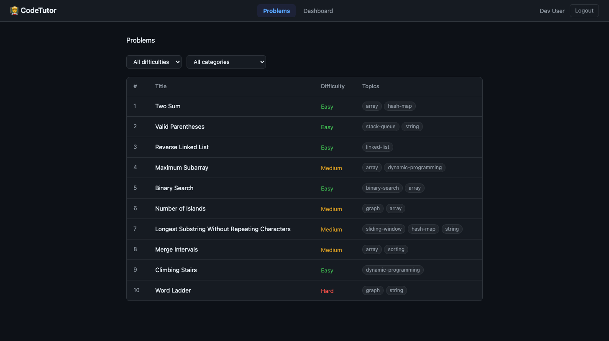
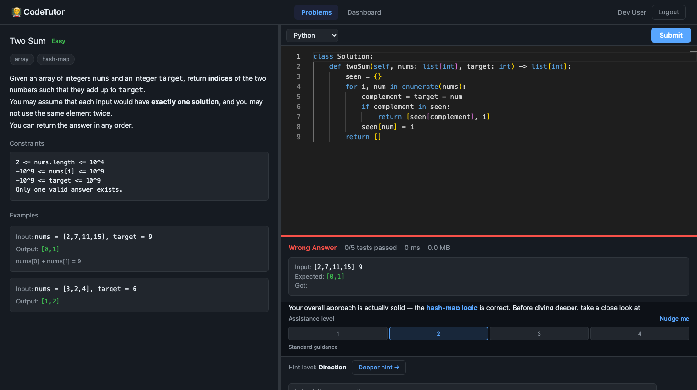
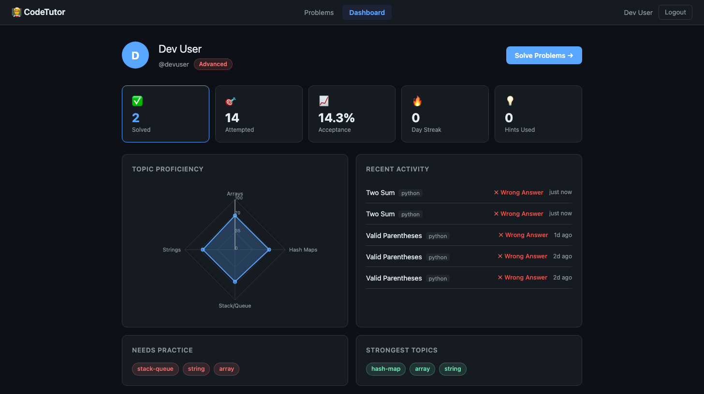

# 🧑‍🏫 CodeTutor — AI-Powered Coding Tutor

An intelligent coding practice platform that goes beyond pass/fail. Submit your code, get real-time AI feedback powered by Claude, and unlock progressively deeper hints as you learn — not just answers.

## Screenshots

<table>
  <tr>
    <td></td>
    <td></td>
  </tr>
  <tr>
    <td align="center"><em>Login with Google, GitHub, or Dev mode</em></td>
    <td align="center"><em>10 curated DSA problems with difficulty & topic tags</em></td>
  </tr>
  <tr>
    <td></td>
    <td></td>
  </tr>
  <tr>
    <td align="center"><em>Monaco editor + live code execution + AI analysis</em></td>
    <td align="center"><em>Knowledge radar chart, stats & recent activity</em></td>
  </tr>
</table>

---

## Features

- **🤖 AI Tutoring** — Submit code and receive instant, Socratic-style feedback from Claude (claude-sonnet-4-5). The tutor nudges you towards the answer rather than giving it away.
- **💡 4-Level Hint Escalation** — Start with a directional nudge, escalate through approach → structure → full walkthrough at your own pace.
- **💬 Follow-up Chat** — Ask follow-up questions in natural language and continue the tutoring conversation with full context.
- **⚡ Real-time Streaming** — AI responses stream token-by-token via SSE so you see feedback as it's generated.
- **🖥️ Monaco Editor** — VS Code's editor in the browser with syntax highlighting for Python, Java, and JavaScript.
- **▶️ Code Execution** — Solutions are run against test cases using the Piston code execution engine.
- **📊 Knowledge Dashboard** — Radar chart visualising topic proficiency across Arrays, Strings, Hash Maps, Stack/Queue, Graphs, and more.
- **🔐 OAuth 2.0 Auth** — Sign in with Google or GitHub; JWT access tokens with silent background refresh.
- **⚙️ Assistance Levels** — Four tutor personas from "Nudge me" (minimal hints) to "Full guidance".
- **🛠️ Admin Panel** — CRUD interface for managing the problem bank.

---

## Tech Stack

| Layer | Technology |
|---|---|
| **Frontend** | React 19, TypeScript, Vite, Tailwind CSS |
| **Editor** | Monaco Editor (`@monaco-editor/react`) |
| **State** | Zustand + `persist` middleware |
| **Backend** | FastAPI (Python 3.12), async/await throughout |
| **Database** | MongoDB 7 via Beanie ODM |
| **Cache / Rate-limit** | Redis 7.2 + SlowAPI |
| **AI** | Anthropic Claude (`claude-sonnet-4-5`) via SSE streaming |
| **Code Execution** | Piston API (self-hostable, multi-language) |
| **Auth** | OAuth 2.0 (Google + GitHub), JWT (access + refresh tokens) |
| **Infrastructure** | Docker Compose |

---

## Getting Started

### Prerequisites

- [Docker Desktop](https://www.docker.com/products/docker-desktop/) — for MongoDB, Redis
- [Python 3.12+](https://www.python.org/downloads/)
- [Node.js 18+](https://nodejs.org/)
- An [Anthropic API key](https://console.anthropic.com/)
- *(Optional)* Google and/or GitHub OAuth credentials for social login

### 1. Clone the repo

```bash
git clone https://github.com/sgkul2000/CodeTutor.git
cd CodeTutor
```

### 2. Start infrastructure (MongoDB + Redis)

```bash
docker compose up -d
```

This starts:
- **MongoDB 7** on port `27017`
- **Redis 7.2** on port `6379`

### 3. Configure the backend

```bash
cd ai-tutor-backend
cp .env.example .env   # or create .env manually (see below)
```

Minimum required `.env`:

```env
# MongoDB
MONGODB_URL=mongodb://localhost:27017
MONGODB_DB_NAME=ai_tutor

# Redis
REDIS_URL=redis://localhost:6379

# JWT
JWT_SECRET_KEY=your-super-secret-key-change-in-production
JWT_ACCESS_TOKEN_EXPIRE_MINUTES=15
JWT_REFRESH_TOKEN_EXPIRE_DAYS=30

# Anthropic
ANTHROPIC_API_KEY=sk-ant-...

# App
ENVIRONMENT=development
BACKEND_URL=http://localhost:8000
FRONTEND_URL=http://localhost:5173

# OAuth (optional — dev login works without these)
# GOOGLE_CLIENT_ID=...
# GOOGLE_CLIENT_SECRET=...
# GITHUB_CLIENT_ID=...
# GITHUB_CLIENT_SECRET=...
```

### 4. Install backend dependencies & seed the database

```bash
# In ai-tutor-backend/
python -m venv .venv
source .venv/bin/activate        # Windows: .venv\Scripts\activate
pip install -r requirements.txt

# Seed 10 DSA problems
python -m scripts.seed_problems
```

### 5. Start the backend

```bash
uvicorn app.main:app --reload --port 8000
```

API docs available at http://localhost:8000/docs

### 6. Install frontend dependencies & start the dev server

```bash
cd ../ai-tutor-frontend
npm install
npm run dev
```

Open http://localhost:5173 in your browser.

### 7. Log in

Click **⚡ Sign in (Dev Mode only)** on the login page — no OAuth credentials required in development.

---

## Project Layout

```
CodeTutor/
├── docker-compose.yml               # MongoDB + Redis
├── ai-tutor-backend/
│   ├── app/
│   │   ├── main.py                  # FastAPI entry-point
│   │   ├── config.py                # Settings (pydantic-settings)
│   │   ├── models/                  # Beanie ODM models (User, Problem, Submission…)
│   │   ├── routers/                 # auth, problems, submissions, tutor
│   │   └── services/
│   │       ├── auth_service.py      # JWT helpers, OAuth client
│   │       ├── judge_service.py     # Piston API integration
│   │       └── tutor_service.py     # Claude streaming, hint escalation
│   ├── scripts/
│   │   └── seed_problems.py         # Seeds 10 starter DSA problems
│   └── requirements.txt
└── ai-tutor-frontend/
    ├── src/
    │   ├── api/                     # Axios client (silent refresh) + SSE helpers
    │   ├── components/              # Shared UI components
    │   ├── hooks/                   # useAuth, useTutor, useProblems…
    │   ├── pages/                   # Login, Problems, ProblemSolve, Dashboard
    │   ├── stores/                  # Zustand app store
    │   └── types/                   # Shared TypeScript types
    └── package.json
```

---

## How the AI Tutor Works

1. **Submit** — Your code is sent to the Piston execution engine and run against test cases.
2. **Analyse** — Regardless of pass/fail, the code and test results are sent to Claude with a Socratic prompt tailored to your chosen **assistance level** (1–4).
3. **Stream** — Claude's response streams back token-by-token via SSE and appears in real time.
4. **Hint escalation** — If you need more help, click **Deeper hint →** to escalate from Direction → Approach → Structure → Full Walkthrough.
5. **Follow-up** — Ask questions in the chat input; the full conversation history is maintained so Claude has context.

---

## Available Scripts

| Directory | Command | Description |
|---|---|---|
| root | `docker compose up -d` | Start MongoDB + Redis |
| `ai-tutor-backend` | `uvicorn app.main:app --reload` | Start API server (port 8000) |
| `ai-tutor-backend` | `python -m scripts.seed_problems` | Seed 10 DSA problems |
| `ai-tutor-frontend` | `npm run dev` | Start Vite dev server (port 5173) |
| `ai-tutor-frontend` | `npm run build` | Production build |
| `ai-tutor-frontend` | `npm run lint` | ESLint check |

---

## API Overview

| Method | Endpoint | Description |
|---|---|---|
| `GET` | `/api/auth/dev-login` | Dev-only instant login |
| `GET` | `/api/auth/{provider}` | OAuth redirect (google/github) |
| `POST` | `/api/auth/refresh` | Silent token refresh |
| `GET` | `/api/problems` | List problems (filter by difficulty/topic) |
| `POST` | `/api/submissions` | Submit code for execution |
| `POST` | `/api/tutor/analyze` | Stream AI analysis of a submission |
| `POST` | `/api/tutor/hint` | Stream next hint level |
| `POST` | `/api/tutor/ask` | Stream follow-up chat response |
| `GET` | `/api/users/dashboard` | User stats + topic proficiency |

Full interactive docs: http://localhost:8000/docs

---

## License

MIT
